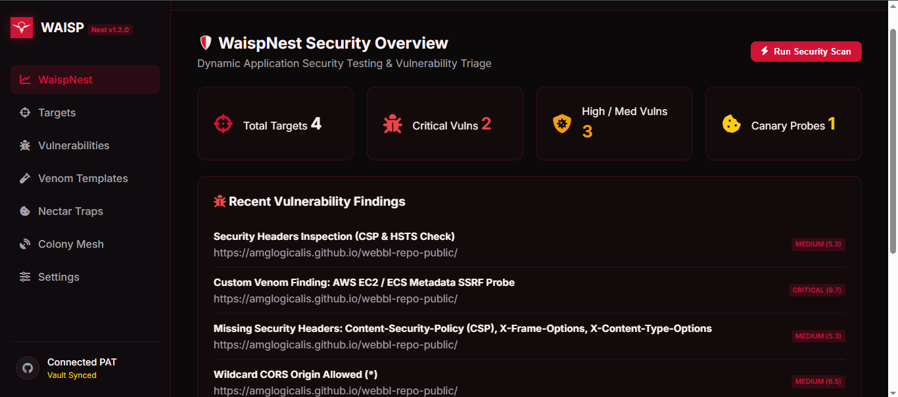

<p align="center">
  <br>
  <h1>🛡️ WAISP — Web Automated Inspection & Security Penetration</h1>
  <p><strong>Terra Ecosystem DAST Engine — Proof-of-Exploit (PoE) & Autonomous AutoPotter Pipeline ($0 Infrastructure)</strong></p>
  
  <a href="https://amglogicalis.github.io/waisp-repo-public/">
    
  </a>
  <a href="https://github.com/amglogicalis/waisp-repo-public">
    
  </a>
  <a href="https://github.com/amglogicalis/waisp-repo-public/blob/main/LICENSE">
    
  </a>
</p>

---

## 🎛️ Consola Web WaispNest Studio

Accede a la consola web interactiva **WaispNest Studio** directamente desde tu navegador en GitHub Pages o ejecútala de forma local en tu máquina:

👉 **[🌐 Abrir Consola Web WaispNest Online en Producción](https://amglogicalis.github.io/waisp-repo-public/)**

<p align="center">
  
</p>

---

## 🐝 ¿Qué es WAISP?

**WAISP** es el titán de **Pentesting Automatizado, DAST (Dynamic Application Security Testing) y Auto-Curación Autónoma (Auto-Healer)** del Ecosistema Terra. Diseñado para ofrecer seguridad de nivel empresarial a **coste $0 de infraestructura**, apalancándose en la computación efímera de GitHub Actions y persistencia inmutable en GitHub Storage.

### 🌟 Innovaciones Clave de WAISP v1.3.0

- **🛡️ Proof-of-Exploit (PoE) Dual-Phase Engine**: ~0% de Falsos Positivos. Descarta automáticamente anomalías ambiguas si no existe una prueba irrefutable de ejecución (canario OOB o prueba sintáctica evaluada en DOM).
- **🧪 NestHiveSandbox**: Entornos de prueba efímeros gratuitos en GitHub Actions. AutoPotter aplica el parche de código en un runner de aislamiento, re-ataca la aplicación y certica cero regresiones antes de abrir la Pull Request.
- **🧬 Mapeo Híbrido AST SAST+DAST**: Traza las vulnerabilidades DAST dinámicas directamente a la línea exacta del código fuente en tu repositorio (ej. `src/api/auth.ts#L42`).
- **🐝 WaispColony Mesh (P2P)**: Red P2P descentralizada y 100% anónima que propaga ondas de inmunidad (`ph_...` hashes) entre suscriptores sin revelar URLs objetivo ni datos personales.
- **☠️ Nectar Trap Family**: Sondas canarias OOB, trampas **Poison Mirror Tarpit** que congelan bots de hackers a 1 byte/segundo y capturan la huella forense del atacante, e inyectores de snippets HoneyTrap (`<script>`, `<meta>`, XXE).

---

## 📦 Instalación Global (CLI & SDK Unificado)

Instala el paquete unificado `terra-waisp` para obtener tanto el ejecutable global `waisp` para tu terminal como la librería SDK para Node.js / TypeScript:

```bash
npm install -g terra-waisp
```

O ejecútalo sin instalación con `npx`:

```bash
npx terra-waisp scan https://mi-app.com
```

---

## 💻 Referencia Completa de la CLI (`waisp`)

### ⚡ 1. Escaneo de Seguridad & AutoPotter Pipeline
```bash
# Escaneo de seguridad completo DAST + PoE + AST
waisp scan https://mi-app.com --modules recon,dast,api,runtime

# Escaneo Proof-of-Exploit (PoE) con creación de PR automática
waisp poe https://mi-app.com

# Ejecutar el bucle de auto-curación autónoma AutoPotter Pipeline en un objetivo
waisp heal <targetId>
```

### 🎯 2. Gestión de Objetivos de Auditoría (Targets CRUD)
```bash
# Agregar un nuevo objetivo
waisp target add https://mi-app.com --name "App Producción" --env prod --provider terra

# Listar objetivos registrados
waisp target list

# Eliminar un objetivo
waisp target delete <targetId>
```

### 🍯 3. Trampas Señuelo & Canarios (Nectar Trap Family)
```bash
# Crear trampa Poison Mirror Tarpit (congelación de atacantes a 1 B/sec)
waisp trap create https://mi-app.com --kind poison_mirror_tarpit

# Crear trampa HoneyTrap Injection Snippet
waisp trap create https://mi-app.com --kind honeytrap_injection

# Listar trampas desplegadas y estado (ARMED / TRIGGERED)
waisp trap list

# Eliminar una trampa
waisp trap delete <trapId>
```

### 🧪 4. Plantillas de Ataque Personalizadas (Venom Templates)
```bash
# Agregar plantilla Venom personalizada
waisp venom add "Custom SSRF Metadata Probe" --category dast --severity CRITICAL --payloads "http://169.254.169.254/latest/meta-data/"

# Listar plantillas Venom registradas
waisp venom list
```

### 📡 5. Red de Inmunidad P2P (WaispColony Mesh)
```bash
# Suscribirse a la red P2P Colony Mesh
waisp colony join

# Ver ondas de amenaza recibidas (Pheromones)
waisp colony signals

# Aplicar regla de inmunidad local con selección de Targets
waisp colony apply <signalId> --targets target1,target2

# Limpiar señales de amenaza y reglas aplicadas
waisp colony clear-signals
waisp colony clear-applied
```

### 🧹 6. Limpieza de Hallazgos y Servidor Local
```bash
# Listar vulnerabilidades en el nido
waisp vulns list

# Limpiar todas las vulnerabilidades registradas en HornetVault
waisp vulns clear

# Levantar la Consola Web WaispNest Studio localmente en tu puerto
waisp studio --port 3722
```

---

## 🛠️ Uso como SDK en Node.js / TypeScript

```typescript
import { Waisp } from 'terra-waisp';

const waisp = new Waisp({
  githubToken: process.env.GITHUB_TOKEN,
  vaultRepo: '.waisp-storage'
});

async function main() {
  await waisp.init();

  // 1. Escaneo DAST + PoE + AutoPotter Pipeline
  const scanResult = await waisp.scan({
    target: 'https://myapp.com',
    modules: ['recon', 'dast', 'api', 'runtime'],
    autoPotterPatch: true
  });

  console.log(`Auditoría completada en ${scanResult.durationMs}ms`);
  console.log(`Vulnerabilidades reales (PoE Verified): ${scanResult.summary.total}`);

  // 2. Suscribirse a la Colony Mesh y aplicar inmunidad
  waisp.colony.optIn();
  const signals = waisp.colony.getPheromones();
  if (signals[0]) {
    const immunity = waisp.colony.applyLocalImmunity(signals[0].id, ['target-id-1']);
    console.log(`Regla de inmunidad ejecutada: ${immunity.appliedTargets.join(', ')}`);
  }
}

main();
```

---

## 📜 Licencia & Filosofía

Desarrollado bajo la filosofía **Terra Ecosystem • Ciberseguridad Ofensiva & Auto-Curación a Coste $0**.  
Licencia MIT.
